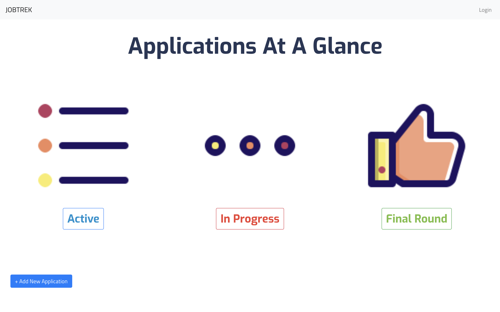

# JOB TREK

This project was bootstrapped with [Create React App](https://github.com/facebook/create-react-app).

## About JOB TREK

Our project _JOB TREK_ for the [2019 WINFO Hackathon](https://www.facebook.com/events/889714264560893/) is a **web application** that helps users _keep track of the state of their job applications_ by _aggregating_ **user-entered data** and _ergonomically organizing the data_.

Our group came up with the idea when contemplating the annoyances in our everyday lives, and we found the standard method of application tracking, Microsoft Excel, to be _tedious_ and somewhat _lacking_. In this way, our web application _makes a world of difference_ to us and to all fellow job seekers by __*organizing the state of our job searches*__, __*creating reminders for required actions*__, and generally __*removing a niggling annoyance of the job search process*__.

### Our Prototypes

1. [Figma](https://www.figma.com/proto/FbYDwU43G3xQywZ48sV124NE/Winfo-Hackathon?node-id=6%3A450&scaling=min-zoom) 
2. [Github](https://github.com/NedSander/winfo-hackathon-2019) (_not deployed_) 

### Authors

- Josh Keating
- Rhea Xinyu Chen
- Ned Sander
- Israel Martinez
- Jerry Lin